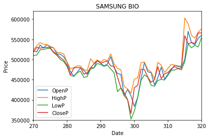
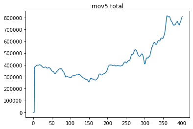
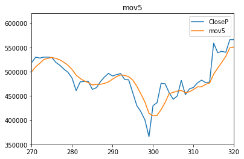
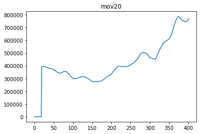
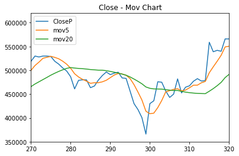
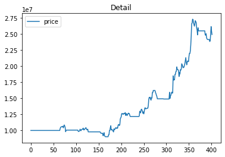
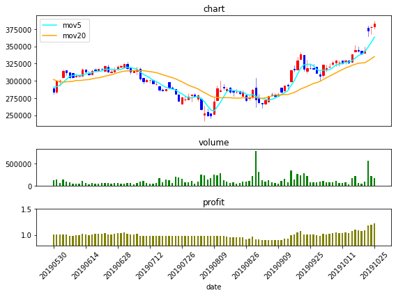

### 삼성바이오로직스
#### 모멘텀 투자 전략
* 변동성이 큰 최근 투자 환경의 변화에따라
* 초 단기물과 단기물간의 변동폭을 활용하여 투자 전략구성

## 기업분석

* 삼성바이오로직스는 바이오의약품 일괄생산 체제를 갖춘 글로벌 바이오 CMO(Contract Manufa-cturing Organization) 기업
* 현재 바이오의약품을 위탁 생산하는 CMO 사업을 전문적으로 영위하고 있음
* 생산설비 제공뿐 아니라 주요 규제기관으로부터의 제조승인 취득을 지원하는 Quality service 및 신약 물질의 상업 생산용 공정개발 solution을 제공하는 Fully-integrated manufacturing service provider를 지향
* 바이오의약품 연구개발 자회사인 삼성바이오에피스와 아키젠바이오텍은 바이오시밀러 개발 및 상업화를 진행 중

## 투자분석
* 삼성바이오로직스의 주가 상승 원인
* 실적이 본격적으로 상승
* 19년 4분기 실적만 봐도 매출액 3,133억원(YoY +75.8%)
* 영업이익 1,070억원(YoY +353.0%)을 기록 주가상승의 당위성을 부여
* 영업이익은 컨센서스(443억원)를 크게 상회


### 모멘텀 투자 전략이란?
* 주가 추세의 속도가 증가, 감소 추세 운동량을 기준화
* 주가의 변공성을 활용한 투자기법
* 가치투자에 상반되는 투자 기법으로 
* 이미 모든 유효한 정보는 가격에 반영되어 있다는 가정으로 분석하는 기술투자 기법


```python
import cx_Oracle
import numpy as np
import pandas as pd

import matplotlib as mpl
import matplotlib.pyplot as plt
```

### 데이터 베이스 연결
* Oracle RDBMS 사용
* 주가 정보 획득용 DB 연결


```python
# 데이터 불러오기
uid='PROJECT1'
upw='Test1234'
url='localhost:1521/orcl'
conn=cx_Oracle.connect(uid,upw,url)
cursor=conn.cursor()
```


```python
sql="select * from STSAMBA where SDATE>20190101 order by sdate asc"
cursor.execute(sql)
res=cursor.fetchall()
len(res)

```


    402


### 기초 통계량 확인
* 평균,표준편차,사분위수


```python
idx=["no","Date","OpenP","HighP","LowP","CloseP","vol","stat"]
df=pd.DataFrame(res,columns=idx)
ndf=df.loc[:,["OpenP","HighP","LowP","CloseP"]]
ndf.describe()# 기초통계량 확인
```


<div>
<style scoped>
    .dataframe tbody tr th:only-of-type {
        vertical-align: middle;
    }

    .dataframe tbody tr th {
        vertical-align: top;
    }

    .dataframe thead th {
        text-align: right;
    }
</style>
<table border="1" class="dataframe">
  <thead>
    <tr style="text-align: right;">
      <th></th>
      <th>OpenP</th>
      <th>HighP</th>
      <th>LowP</th>
      <th>CloseP</th>
    </tr>
  </thead>
  <tbody>
    <tr>
      <th>count</th>
      <td>402.000000</td>
      <td>402.000000</td>
      <td>402.000000</td>
      <td>402.000000</td>
    </tr>
    <tr>
      <th>mean</th>
      <td>440134.328358</td>
      <td>447904.228856</td>
      <td>432949.004975</td>
      <td>440278.606965</td>
    </tr>
    <tr>
      <th>std</th>
      <td>152970.049440</td>
      <td>156230.974405</td>
      <td>149189.791965</td>
      <td>152706.005709</td>
    </tr>
    <tr>
      <th>min</th>
      <td>250500.000000</td>
      <td>253000.000000</td>
      <td>241500.000000</td>
      <td>249500.000000</td>
    </tr>
    <tr>
      <th>25%</th>
      <td>320500.000000</td>
      <td>327625.000000</td>
      <td>317000.000000</td>
      <td>321875.000000</td>
    </tr>
    <tr>
      <th>50%</th>
      <td>392500.000000</td>
      <td>397000.000000</td>
      <td>387000.000000</td>
      <td>391750.000000</td>
    </tr>
    <tr>
      <th>75%</th>
      <td>495500.000000</td>
      <td>500000.000000</td>
      <td>487125.000000</td>
      <td>494750.000000</td>
    </tr>
    <tr>
      <th>max</th>
      <td>846000.000000</td>
      <td>863000.000000</td>
      <td>814000.000000</td>
      <td>843000.000000</td>
    </tr>
  </tbody>
</table>
</div>


### 그래프 분석
* 전체적 주가변동 그래프 확인


```python
ndf.plot()
plt.title("SAMSUNG BIO")
plt.xlabel("Date")
plt.ylabel("Price")
plt.xlim(270,320)
plt.ylim(350000,620000)
plt.legend()
plt.show()
```





### 단기 이동평균선 확인
* 해당 주식에 맞는 단기 이동 평균선 작성


```python
#5일평균선
cp=df.loc[:,["CloseP"]]
mov5=[0,0,0,0]
sum=0
i=0
avg=0;
npCp=np.array(cp.values)

#npCp[:5]
#np.average(npCp[:5])

```


```python
ans=[0,0,0,0]
for i in range(len(cp)-4):
    avg=np.average(npCp[i:i+5])
    ans.append(avg)
ans
plt.plot(ans)
plt.title("mov5 total")
plt.show()
```





```python
df['mov5']=pd.Series(ans)
df.tail()
```


<div>
<style scoped>
    .dataframe tbody tr th:only-of-type {
        vertical-align: middle;
    }

    .dataframe tbody tr th {
        vertical-align: top;
    }

    .dataframe thead th {
        text-align: right;
    }
</style>
<table border="1" class="dataframe">
  <thead>
    <tr style="text-align: right;">
      <th></th>
      <th>no</th>
      <th>Date</th>
      <th>OpenP</th>
      <th>HighP</th>
      <th>LowP</th>
      <th>CloseP</th>
      <th>vol</th>
      <th>stat</th>
      <th>mov5</th>
    </tr>
  </thead>
  <tbody>
    <tr>
      <th>397</th>
      <td>6026</td>
      <td>20200810</td>
      <td>768000</td>
      <td>781000</td>
      <td>756000</td>
      <td>771000</td>
      <td>177707</td>
      <td>0</td>
      <td>767800.0</td>
    </tr>
    <tr>
      <th>398</th>
      <td>6025</td>
      <td>20200811</td>
      <td>793000</td>
      <td>832000</td>
      <td>783000</td>
      <td>804000</td>
      <td>761446</td>
      <td>0</td>
      <td>781600.0</td>
    </tr>
    <tr>
      <th>399</th>
      <td>6024</td>
      <td>20200812</td>
      <td>815000</td>
      <td>854000</td>
      <td>814000</td>
      <td>843000</td>
      <td>760424</td>
      <td>0</td>
      <td>792800.0</td>
    </tr>
    <tr>
      <th>400</th>
      <td>6023</td>
      <td>20200813</td>
      <td>837000</td>
      <td>844000</td>
      <td>809000</td>
      <td>820000</td>
      <td>366305</td>
      <td>0</td>
      <td>801200.0</td>
    </tr>
    <tr>
      <th>401</th>
      <td>6022</td>
      <td>20200814</td>
      <td>815000</td>
      <td>830000</td>
      <td>791000</td>
      <td>803000</td>
      <td>143298</td>
      <td>0</td>
      <td>808200.0</td>
    </tr>
  </tbody>
</table>
</div>


```python
ndf=df.loc[:,["CloseP","mov5"]]
ndf.plot()
plt.title("mov5")
plt.xlim(270,320)
plt.ylim(350000,620000)
plt.show()
```





### 장기 이동평균선
* 해당 주식에 맞는 장기이동 평균선 제작


```python
#20일 이평선
ans=[]
for i in range(19):
    ans.append(0)
    
for i in range(len(cp)-19):
    avg=np.average(npCp[i:i+20])
    ans.append(avg)
#ans

```


```python
plt.plot(ans)
plt.title("mov20")
plt.show()
```





```python
df['mov20']=pd.Series(ans)
df.tail()
```


<div>
<style scoped>
    .dataframe tbody tr th:only-of-type {
        vertical-align: middle;
    }

    .dataframe tbody tr th {
        vertical-align: top;
    }

    .dataframe thead th {
        text-align: right;
    }
</style>
<table border="1" class="dataframe">
  <thead>
    <tr style="text-align: right;">
      <th></th>
      <th>no</th>
      <th>Date</th>
      <th>OpenP</th>
      <th>HighP</th>
      <th>LowP</th>
      <th>CloseP</th>
      <th>vol</th>
      <th>stat</th>
      <th>mov5</th>
      <th>mov20</th>
    </tr>
  </thead>
  <tbody>
    <tr>
      <th>397</th>
      <td>6026</td>
      <td>20200810</td>
      <td>768000</td>
      <td>781000</td>
      <td>756000</td>
      <td>771000</td>
      <td>177707</td>
      <td>0</td>
      <td>767800.0</td>
      <td>753400.0</td>
    </tr>
    <tr>
      <th>398</th>
      <td>6025</td>
      <td>20200811</td>
      <td>793000</td>
      <td>832000</td>
      <td>783000</td>
      <td>804000</td>
      <td>761446</td>
      <td>0</td>
      <td>781600.0</td>
      <td>756850.0</td>
    </tr>
    <tr>
      <th>399</th>
      <td>6024</td>
      <td>20200812</td>
      <td>815000</td>
      <td>854000</td>
      <td>814000</td>
      <td>843000</td>
      <td>760424</td>
      <td>0</td>
      <td>792800.0</td>
      <td>761550.0</td>
    </tr>
    <tr>
      <th>400</th>
      <td>6023</td>
      <td>20200813</td>
      <td>837000</td>
      <td>844000</td>
      <td>809000</td>
      <td>820000</td>
      <td>366305</td>
      <td>0</td>
      <td>801200.0</td>
      <td>765950.0</td>
    </tr>
    <tr>
      <th>401</th>
      <td>6022</td>
      <td>20200814</td>
      <td>815000</td>
      <td>830000</td>
      <td>791000</td>
      <td>803000</td>
      <td>143298</td>
      <td>0</td>
      <td>808200.0</td>
      <td>768950.0</td>
    </tr>
  </tbody>
</table>
</div>


```python
ndf=df.loc[:,["CloseP","mov5","mov20"]]
ndf.plot()
plt.title("Close - Mov Chart")
plt.xlim(270,320)
plt.ylim(350000,620000)
plt.show()
```





### 모멘텀 분석의 장점
* 단이평선이 장이평선 하단에 위치할 경우 주식을 보유하지 않고 있어서
* 급격한 주가 하락에 대한 방어적 요소가 강함
* 그중 5일물과 20일물의 비교 분석이 제일 좋은 성과를 가지고 있음
* 5-20 프로그래밍 매매 시뮬레이션 결과
* 방어적 성향의 보수적 이익 실현가능


```python
# 1000만원 수익률 분석하기
mv5=df['mov5']
mv20=df['mov20']
cp=df['CloseP']
buysell=[]
bfStat=0
ans=[]
#초기화
inStock=0
myStock=[]
myBank=[]
baseMoney=10000000
movDay=20

for i in range(movDay):
    ans.append(0)
    myBank.append(baseMoney)
    myStock.append(0)
    

for i in range(movDay,len(mv5)):
    if(mv5[i]>mv20[i]):
        nowStat=1;
    else:
        nowStat=-1
        
    baseMoney=myBank[i-1]
    inStock=myStock[i-1]
    
    if(bfStat==-1):#단이평선이 아래
        if(nowStat==1):
            #print("매수")
            canBuy=baseMoney//cp[i]
            baseMoney-=canBuy*cp[i]
            # 계좌 잔고
            inStock=canBuy
            
            ans.append(1)
        else:
            #print("대기")
            ans.append(0)
    else:# 단이평선이 위에 있음
        if(nowStat==1):
            #print("대기")
            ans.append(0)
        else:
            if(inStock>0):
                baseMoney+=inStock*cp[i]
                # 주식 보유수
                inStock=0
                #print("매도")
                ans.append(-1)
            else: # 주식 보유 안할때
                #print("대기")
                ans.append(0)
    myStock.append(inStock)
    myBank.append(baseMoney);
    bfStat=nowStat 
    # 일이 마무리되면 현재상태가 과거상태로변환
        
ans[:100]    
df['timing']=pd.Series(ans)
df['myStock']=pd.Series(myStock)
df['myBank']=pd.Series(myBank)
# 통장잔고+ 주식수* 현재주식가치
df['price']=df['myBank']+df['myStock']*df['CloseP']
df['profit']=df['price']/10000000

```


```python
df.tail()
```


<div>
<style scoped>
    .dataframe tbody tr th:only-of-type {
        vertical-align: middle;
    }

    .dataframe tbody tr th {
        vertical-align: top;
    }

    .dataframe thead th {
        text-align: right;
    }
</style>
<table border="1" class="dataframe">
  <thead>
    <tr style="text-align: right;">
      <th></th>
      <th>no</th>
      <th>Date</th>
      <th>OpenP</th>
      <th>HighP</th>
      <th>LowP</th>
      <th>CloseP</th>
      <th>vol</th>
      <th>stat</th>
      <th>mov5</th>
      <th>mov20</th>
      <th>timing</th>
      <th>myStock</th>
      <th>myBank</th>
      <th>price</th>
      <th>profit</th>
    </tr>
  </thead>
  <tbody>
    <tr>
      <th>397</th>
      <td>6026</td>
      <td>20200810</td>
      <td>768000</td>
      <td>781000</td>
      <td>756000</td>
      <td>771000</td>
      <td>177707</td>
      <td>0</td>
      <td>767800.0</td>
      <td>753400.0</td>
      <td>0</td>
      <td>31</td>
      <td>17500</td>
      <td>23918500</td>
      <td>2.39185</td>
    </tr>
    <tr>
      <th>398</th>
      <td>6025</td>
      <td>20200811</td>
      <td>793000</td>
      <td>832000</td>
      <td>783000</td>
      <td>804000</td>
      <td>761446</td>
      <td>0</td>
      <td>781600.0</td>
      <td>756850.0</td>
      <td>0</td>
      <td>31</td>
      <td>17500</td>
      <td>24941500</td>
      <td>2.49415</td>
    </tr>
    <tr>
      <th>399</th>
      <td>6024</td>
      <td>20200812</td>
      <td>815000</td>
      <td>854000</td>
      <td>814000</td>
      <td>843000</td>
      <td>760424</td>
      <td>0</td>
      <td>792800.0</td>
      <td>761550.0</td>
      <td>0</td>
      <td>31</td>
      <td>17500</td>
      <td>26150500</td>
      <td>2.61505</td>
    </tr>
    <tr>
      <th>400</th>
      <td>6023</td>
      <td>20200813</td>
      <td>837000</td>
      <td>844000</td>
      <td>809000</td>
      <td>820000</td>
      <td>366305</td>
      <td>0</td>
      <td>801200.0</td>
      <td>765950.0</td>
      <td>0</td>
      <td>31</td>
      <td>17500</td>
      <td>25437500</td>
      <td>2.54375</td>
    </tr>
    <tr>
      <th>401</th>
      <td>6022</td>
      <td>20200814</td>
      <td>815000</td>
      <td>830000</td>
      <td>791000</td>
      <td>803000</td>
      <td>143298</td>
      <td>0</td>
      <td>808200.0</td>
      <td>768950.0</td>
      <td>0</td>
      <td>31</td>
      <td>17500</td>
      <td>24910500</td>
      <td>2.49105</td>
    </tr>
  </tbody>
</table>
</div>


### 분석결과
* 주가 하락시 상당히 좋은 포지션으로 주가하락을 방어하고 있다
* 조사 범위중 2군데정도 방어가 미흡한 부분이 보이는데
* 급격한 하락에 최선을 다한 것으로 보여진다.


```python
ndf=df.loc[:,['price']]
ndf.plot()
plt.title("Detail")
plt.show()
```





```python
from mpl_finance import candlestick_ohlc
import matplotlib.gridspec as gridspec
```


```python
# 그래프 베이스 준비
fig = plt.figure(figsize=(8,6))
fig.set_facecolor('w')
gs=gridspec.GridSpec(3,1,height_ratios=[3,1,1])
axes=[]
axes.append(plt.subplot(gs[0]))
axes.append(plt.subplot(gs[1],sharex=axes[0]))
axes.append(plt.subplot(gs[2],sharex=axes[1]))

# 데이터 준비
cdf=df.loc[100:200,['Date','OpenP','HighP','LowP','CloseP','vol','mov5','mov20','profit','price']]
print(cdf.tail())
#캔들 차트 그리기
x=np.arange(len(cdf.index))
ohlc=cdf[['OpenP','HighP','LowP','CloseP']].astype(int).values
dohlc=np.hstack((np.reshape(x,(-1,1)),ohlc))
# 주가차트 작성
candlestick_ohlc(axes[0],dohlc,width=0.5,colorup='r',colordown='b')
axes[0].plot(x,cdf['mov5'], color='cyan',label="mov5")
axes[0].plot(x,cdf['mov20'],color='orange',label="mov20")
# 거래량 차트 작성
axes[1].bar(x,cdf['vol'],color='g',width=0.5,align='center')
axes[2].bar(x,cdf['profit'],color='olive',width=0.5,align='center')
axes[2].set_ylim([0.8,1.5])

axes[2].set_xlabel('date')

axes[0].get_xaxis().set_visible(False)
axes[1].get_xaxis().set_visible(False)
#axes[1].set_xticklabels([])
axes[0].set_title('chart')
axes[1].set_title('volume')
axes[2].set_title('profit')
#####
plt.xticks(np.arange(min(x), max(x)+1, step=10), 
           [x for x in cdf['Date'][::10]], 
           rotation=45)
#####
plt.tight_layout()
#plt.title('Candle chart- Samsung bio')
axes[0].legend()
plt.show()

```

             Date   OpenP   HighP    LowP  CloseP     vol      mov5     mov20  \
    196  20191021  343500  344000  338500  339500   51210  338700.0  325950.0   
    197  20191022  341000  349500  341000  344000   90349  342300.0  326225.0   
    198  20191023  377000  380500  365000  372500  565378  349000.0  329000.0   
    199  20191024  378000  380000  368000  378000  220840  355600.0  331975.0   
    200  20191025  379000  387500  376000  383500  168739  363500.0  335250.0   
    
          profit     price  
    196  1.07610  10761000  
    197  1.09005  10900500  
    198  1.17840  11784000  
    199  1.19545  11954500  
    200  1.21250  12125000  
    




