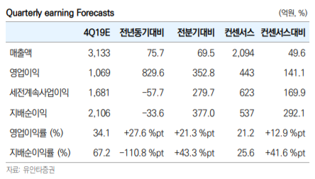

# 삼성바이오로직스
## 기업분석

* 삼성바이오로직스는 바이오의약품 일괄생산 체제를 갖춘 글로벌 바이오 CMO(Contract Manufa-cturing Organization) 기업
* 현재 바이오의약품을 위탁 생산하는 CMO 사업을 전문적으로 영위하고 있음
* 생산설비 제공뿐 아니라 주요 규제기관으로부터의 제조승인 취득을 지원하는 Quality service 및 신약 물질의 상업 생산용 공정개발 solution을 제공하는 Fully-integrated manufacturing service provider를 지향
* 바이오의약품 연구개발 자회사인 삼성바이오에피스와 아키젠바이오텍은 바이오시밀러 개발 및 상업화를 진행 중


## 투자분석
* 삼성바이오로직스의 주가 상승 원인
* 실적이 본격적으로 상승
* 19년 4분기 실적만 봐도 매출액 3,133억원(YoY +75.8%)
* 영업이익 1,070억원(YoY +353.0%)을 기록 주가상승의 당위성을 부여
* 영업이익은 컨센서스(443억원)를 크게 상회


### 한계
* 정보획득의 한계로 모멘텀 투자 전략 사용
### 모멘텀 투자 전략이란?
* 주가 추세의 속도가 증가, 감소 추세 운동량을 기준화
* 주가의 변공성을 활용한 투자기법
* 가치투자에 상반되는 투자 기법으로 
* 이미 모든 유효한 정보는 가격에 반영되어 있다는 가정으로 분석하는 기술투자 기법


### 주식 정보 가져오기

* url=https://finance.naver.com/item/sise_day.nhn?code=207940&page=1
* url로부터 html 가져오기 requests
* 가져온 html로부터 분석하기 BeautifulSoup
* 해당객체의 정보 가져오기


```python
import requests
from bs4 import BeautifulSoup
import cx_Oracle
```
# 에러처리

    except cx_Oracle.DatabaseError as exc:
        error, = exc.args
        print("Oracle-Error-Code:", error.code)
        print("Oracle-Error-Message:", error.message)
        
# 수업의 코드
for error in curr.getbatcherrors():
    print("Error", error.message.rstrip(), "at row offset", error.offset)

```python
# oracle DB 접속
uid='PROJECT1'
upw='Test1234'
url='localhost:1521/orcl'
conn=cx_Oracle.connect(uid,upw,url)
cursor=conn.cursor()
#print(cursor)
url='https://finance.naver.com/item/sise_day.nhn?code=207940&page=1'
```


```python
#data = [20200812, 19250, 20100, 19050, 19550, 8846552]
def insertStock(data=[]):
    sql = "insert into STOCKNAV (SIDX,SDATE,OPENP,HIGHP,LOWP,CLOSEP,VOL,SSTAT) values(STOCK_SEQ.NEXTVAL,{0},{1},{2},{3},{4},{5},0)"
    sql1= sql.format(*data)
    
    try:
        cursor.execute(sql1)
        return(1)
    except cx_Oracle.DatabaseError as exc:
        error, = exc.args
        print("Oracle-Error-Code:", error.code)
        print("Oracle-Error-Message:", error.message)
        return(0)
    
#insertStock(data)
```


```python
#data=[20200811, 19250, 20100, 19050, 19550, 8846552]
def addData(data):
    sql="select * from STSAMBA where SDATE="+str(data[0])
    cursor.execute(sql)
    res=cursor.fetchall()
    if(len(res)>0):
        print("데이터 중복")
    else:
        #print("입력가능 ")
        insertStock(data)
        conn.commit()
        print(data[0]," 입력완료 ")
#addData(data)
```


```python
def setData(src):
    for d in src:
        tgt=d.select('td')
        n=len(d.select('td.num'))
        if(n>0):
            sdate=tgt[0].get_text().replace(".","")
            endp=tgt[1].get_text().replace(",","")
            startp=tgt[3].get_text().replace(",","")
            maxp=tgt[4].get_text().replace(",","")
            minp=tgt[5].get_text().replace(",","")
            vol=tgt[6].get_text().replace(",","")
            t=[int(sdate),int(startp),int(maxp),int(minp),int(endp),int(vol)]
            addData(t)
            print(t)

```


```python
def myNaverStock(url):
    req=requests.get(url)
    res=req.text[:100]
    if(len(res)>50): # 많이 긁으면 서버가 경고 메세지 날릴수도 있다. 경고 메세지(대략 50자) 이상 들어와야지 시작
        html=req.text
        soup=BeautifulSoup(html,'html.parser')
        src=soup.select('table.type2 > tr')
        setData(src)
```


```python
baseUrl='https://finance.naver.com/item/sise_day.nhn?code=207940&page='
for i in range(100,200):
    url=baseUrl+str(i)
    myNaverStock(url)
```

    데이터 중복
    [20161116, 168500, 173000, 163500, 170000, 1660976]
    데이터 중복
    [20161115, 179000, 181500, 162500, 166000, 2592949]
    데이터 중복
    [20161114, 165000, 177500, 165000, 175500, 2977177]
    데이터 중복
    [20161111, 149500, 186500, 142000, 161500, 8140539]
    데이터 중복
    [20161110, 135000, 148000, 125500, 144000, 7179018]
    


    ---------------------------------------------------------------------------

    ValueError                                Traceback (most recent call last)

    <ipython-input-20-b907beda02ec> in <module>
          2 for i in range(100,200):
          3     url=baseUrl+str(i)
    ----> 4     myNaverStock(url)
    

    <ipython-input-19-4c19d98a965a> in myNaverStock(url)
          6         soup=BeautifulSoup(html,'html.parser')
          7         src=soup.select('table.type2 > tr')
    ----> 8         setData(src)
    

    <ipython-input-18-a112a0cae4c8> in setData(src)
         10             minp=tgt[5].get_text().replace(",","")
         11             vol=tgt[6].get_text().replace(",","")
    ---> 12             t=[int(sdate),int(startp),int(maxp),int(minp),int(endp),int(vol)]
         13             addData(t)
         14             print(t)
    

    ValueError: invalid literal for int() with base 10: '\xa0'


```python

```
